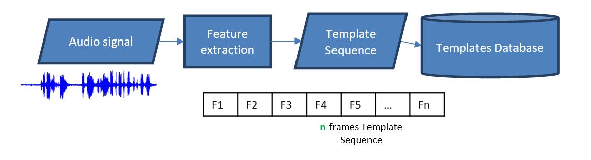
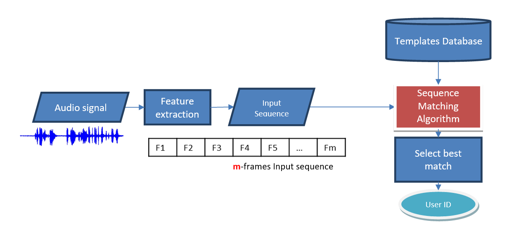

# Speaker-Identification

a speaker recognition/identification system, which can be able to identify a person from the characteristics of his/her voice.

## Defintion

Each person has some acoustic features that differ from a person to the other, these features reflect the anatomy (e.g: the shape and size of the throat and mouth) and learned behavioral patterns (e.g: voice pitch, speaking style) of the speaker. Using these features we built our SpeakerID system.

Typical speaker identification systems usually include two stages:

<ul style="list-style: none">
    <li>
        

            <h2>1) Enrollment:</h2>
            
In this stage, a new user has entered the system, so we need to build a template for that user to be used later for the identification stage.

            
        

    </li>
    <li>
        

            <h2>2) Testing (Identification):</h2>
            
An unknown user is present, and we wish to identify him/her. To identify the unknown user. First, we need to build a sequence for the new user. Second, match the new input sequence with our existing database of template sequences, and find the best match.

            
        

    </li>
</ul>

## Matching Algorithm

### Dynamic Time Warping (DTW) Without Pruning

<ul>
    <li>
        

            <h4>Purpose</h4>
            
This function calculates the dynamic time warping (DTW) distance between two sequences <b>without pruning</b>. It uses a full N×M matrix to compute the optimal alignment cost.

        

    </li>
    <li>
        

            <h4>Parameters</h4>
            <ul>
                <li><b>Input:</b> The test sequence.</li>
                <li><b>Template:</b> The reference or training sequence.</li>
                <li><b>N:</b> Number of frames in the input sequence.</li>
                <li><b>M:</b> Number of frames in the template sequence.</li>
            </ul>
        

    </li>
    <li>
        

            <h4>Steps</h4>
            <ul>
                <li>Define matrix with space complexity of <b>N * M.</b></li>
                <li>Set the first Element <b>“dissimilarityMatrix[0,0]”</b> is cost to be <b>0</b>.</li>
                <li>Initialize the first column & row with <b>infinity</b>.</li>
                <li>Check if either of the sequences is empty then return last element in the matrix.</li>
                <li>Fill the DP table by calculating the <b>Euclidian Distance</b> and add to it the minimum cost transition.</li>
            </ul>
        

    </li>
    <li>
        

            <h4>Overall Complexity</h4>
            <ul>
                <li><b>Time Complexity:</b> Θ(N \* M)</li>
                <li><b>Space Complexity:</b> Θ(N \* M)</li>
            </ul>
        

    </li>
</ul>

### Dynamic Time Warping (DTW) With Pruning

<ul>
    <li>
        

            <h4>Purpose</h4>
            
Calculates DTW distance <b>with a pruning window</b> to reduce computation by limiting the area of the cost matrix that is explored.

        

    </li>
    <li>
        

            <h4>Parameters</h4>
            <ul>
                <li><b>Input:</b> The test sequence.</li>
                <li><b>Template:</b> The reference or training sequence.</li>
                <li><b>N:</b> Number of frames in the input sequence.</li>
                <li><b>M:</b> Number of frames in the template sequence.</li>
                <li><b>pruningWidth:</b> The width of the window for allowable warping.</li>
            </ul>
        

    </li>
    <li>
        

            <h4>Steps</h4>
            <ul>
                <li><b>divide width by 2</b> because we have <b>symmetrical sequence</b> with <b>centered window</b>.</li>
                <li>Ensure the <b>width covers the diagonal</b> from (0,0) to (N,M) to prevent ignoring the main path if sequences differ significantly in length.</li>
                <li>Define <b>rolling arrays to save memory</b> because we only need the current and the previous row for calculations, each of them is <b>size</b> is the <b>[full width + 1]</b>.</li>
                <li>Initialize the previous row with <b>infinity</b> except the center element is <b>0</b>.</li>
                <li>Use offset indexing to store valid cells in the pruned band.</li>
                <li>Calculate <b>Euclidian Distance</b> and add to it the minimum cost transition.</li>
            </ul>
        

    </li>
    <li>
        

            <h4>Overall Complexity</h4>
            <ul>
                <li><b>Time Complexity:</b> O(N * W) ⟶ significantly faster than O(N * M) </li>
                <li><b>Space Complexity:</b> O(W) ⟶ only two rows of the band are stored</li>
            </ul>
        

    </li>
</ul>

### Dynamic Time Warping (DTW) With Beam Search

<ul>
    <li>
        

            <h4>Purpose</h4>
            
Calculates DTW distance <b>using beam search pruning</b> to reduce computation by limiting the path cost.

        

    </li>
    <li>
        

            <h4>Parameters</h4>
            <ul>
                <li><b>Input:</b> The test sequence.</li>
                <li><b>Template:</b> The reference or training sequence.</li>
                <li><b>N:</b> Number of frames in the input sequence.</li>
                <li><b>M:</b> Number of frames in the template sequence.</li>
                <li><b>beamWidth:</b> Maximum allowable cost margin from the best path in a row.</li>
            </ul>
        

    </li>
    <li>
        

            <h4>Steps</h4>
            <ul>
                <li>Allocate two rows <b>(previousRow and currentRow)</b> to hold dynamic costs, of <b>size M + 1</b>.</li>
                <li>Initialize all values in previousRow to <b>∞</b>, except for <b>previousRow[0] = 0</b> (starting point).</li>
                <li>
                    For each row <b>i</b> in the input sequence:
                    <uL>
                        <li>Clear <b>currentRow</b> by setting all elements to <b>∞</b>.</li>
                        <li>For each column <b>j</b>, compute the path cost from previousRow using match, stretch, and shrink.</li>
                        <li>Track the minimum path cost in the row.</li>
                        <li>Prune: any <b>currentRow[j]</b> with cost > <b>(minCostInRow + beamWidth)</b> is discarded (set to <b>∞</b>).</li>
                        <li>Swap buffers for the next iteration.</li>
                    </ul>
                </li>
                <li>Final cost is <b>previousRow[M]</b>.</li>
            </ul>
        

    </li>
    <li>
        

            <h4>Overall Complexity</h4>
            <ul>
                <li><b>Time Complexity:</b> O(N × M) in the worst case (no pruning), but faster in practice depending on beamWidth.</li>
                <li><b>Space Complexity:</b> O(M) due to using two rows only.</li>
            </ul>
        

    </li>
</ul>

## Team Members

<ul>
    <li>Yousef Idris</li>
    <li>Yousef Abdullah</li>
    <li>Mohammed Hany</li>
    <li>Maria Rafik</li>
    <li>Karim Sherif</li>
</ul>
